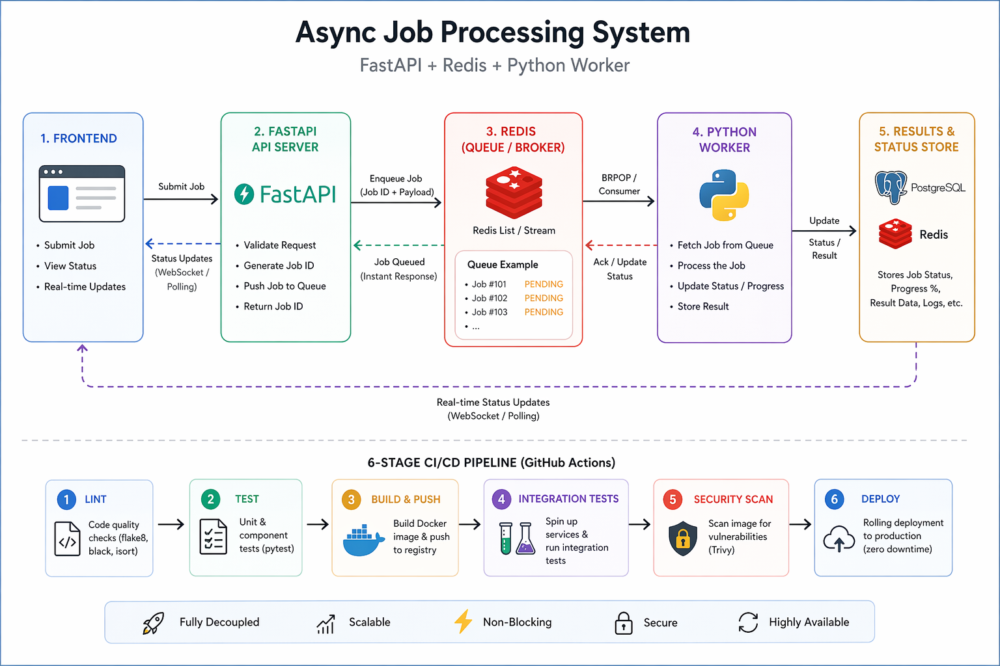

# 🚀 Async Job Processing System (FastAPI + Redis + Workers)

This project demonstrates a **non-blocking, distributed job processing system** where heavy workloads are offloaded to background workers—keeping APIs fast and responsive under load.

---

## 🧠 Architecture Overview

  

- **Frontend (Node.js/Express)**  
  Renders dashboard + proxies API requests  

- **API (FastAPI)**  
  Validates requests, creates jobs, pushes to Redis  

- **Worker (Python)**  
  Consumes jobs, processes asynchronously, updates status  

- **Redis**  
  Acts as queue + job state store  

---

## ⚙️ Key Features

- Non-blocking API design (async job queue)
- Fully containerized (Docker Compose)
- Real-time job status tracking
- Decoupled services (API, worker, frontend)
- Production-style CI/CD pipeline with:
  - Linting (flake8, eslint, hadolint)
  - Testing (pytest)
  - Image build & push
  - Security scanning (Trivy)
  - Integration testing (full stack)
  - Rolling deployment with health checks

---

## 🛠️ Tech Stack

FastAPI • Redis • Python • Node.js • Docker • GitHub Actions

---

## ▶️ Run Locally

```bash
### How to run locally
1. Clone the repository: git clone https://github.com/nehecodes/hng14-stage2-devops.git && cd hng14-stage2-devops
2. Create your .env file and copy .env.example into it: cp .env.example .env
3. Build and start containers: docker compose up --build
4. Check the containers' status: docker compose ps  

    Expected Output:

    | NAME             | IMAGE                           | STATUS                    |
    |------------------|---------------------------------|---------------------------|
    | app_api          | hng14-stage2-devops-api         | Up 30 seconds (healthy)   |
    | app_worker       | hng14-stage2-devops-worker      | Up 30 seconds (healthy)   |
    | app_frontend     | hng14-stage2-devops-frontend    | Up 20 seconds (healthy)   |
    | app_redis        | redis:latest                    | Up 30 seconds (healthy)   |   

    #### What a Successful Startup Looks Like
    ```
    $ docker compose up --build  
    [+] Building ...  
    => [api] build complete  
    => [worker] build complete  
    => [frontend] build complete  

    [+] Running 4/4  
    ✔ Container hng14-redis-1     Healthy    0.8s  
    ✔ Container hng14-api-1       Healthy   16.2s  
    ✔ Container hng14-worker-1    Healthy   22.0s  
    ✔ Container hng14-frontend-1  Healthy   28.5s  

    hng14-api-1       | INFO:     Application startup complete.  
    hng14-api-1       | INFO:     Uvicorn running on http://0.0.0.0:8000  
    hng14-worker-1    | Processing job a1b2c3d4-...  
    hng14-worker-1    | Done: a1b2c3d4-...  
    hng14-frontend-1  | Frontend running on port 3000  
    ```

5. Open http://localhost:3000 in your browser
6. To stop running containers: docker compose down

### CI/CD Pipeline
1. Lint: flake8 (Python), eslint (JS), hadolint (Dockerfiles)
2. Test: pytest with Redis fully mocked; uploads coverage XML as an artifact
3. Build: Builds all three images, tags with git SHA + latest, pushes to an in-job local registry
4. Security Scan: Trivy scans all images; fails on any CRITICAL finding; uploads SARIF to GitHub Security
5. Integration Test: Brings the full stack up inside the runner, submits a real job, polls until completed, tears down
6. Deploy: Pushes to main only; performs a scripted rolling update via SSH with a 60-second health-check gate

### Deploy Secrets
The deploy stage requires the following repository secrets:
